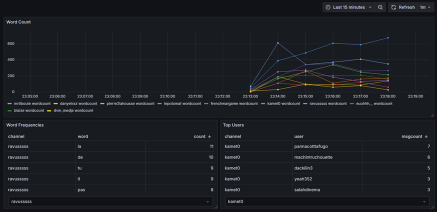

# Processing Twitch Messages in Real Time

This is an academic project to learn about Big Data Architecture. It is an implementation of the Lambda architecture to store and process twitch livestreams messages in real time. THe architecture is developped in Docker.

Twitch is a streaming platform that allows viewers to interact with them by a chat. These can be processed in order to better understand communities and trends.

A producer get the messages from the Twitch API and send them to a single Kafka topic. Then the spark-master container processes these messages with Spark Streaming and send them to Cassandra. Finally, a Grafana container allows to visualize the results.

## Installation
Download the repo and build the containers by running ```start_containers.sh```.
Make sure to have a .env file in ```/producer/app/``` to be able to query the Twitch api.
Get the IP adress of ```cassandra1``` container (in inspect/network) and replace it in ```kappa/apps/cassandra_create_tables.py```

Then you can try to run ```start.sh``` script but often it fails. This can be because pip didn't install the python packages needed.
IF NEEDED, open a terminal and run the following    
```docker exec -ti producer bash```     
```cd app```       
```pip install -r requirements.txt```   

Open another terminal and run   
```docker exec -ti spark-master bash```     
```cd ../spark-apps```      
```pip install requirements.txt```      

Now you can start the producer to get the Twitch messages sent to Kafka. Ine the terminal accessing the producer container, run     
```python3 kafka_remove_topic.py```     
```python3 kafka_create_topic.py```     
```python3 producer_twitch.py```    

In the terminal accessing the spark-master container, run   
```python3 cassandra_create_tables.py```    
```bash start_streaming.sh```   

Open a new terminal to access Cassandra 
```docker exec -ti cassandra1 cqlsh```  
```use projet;```   
```describe tables;```  

Here are some commands you can run :    
```select * from wordcount;```  
```select * from wordfreq limit 10;```  
```select * from msgperuser limit 10;```    

You can open Grafana at http://localhost:3000/. I am not sure this will work as it hasn't been tested but you can try to import the dashboard in the root folder ```Twitch streaming.json```

## Processes
Some simple calculations are performed both in real time and in batch. The first task is to evaluate the number of words per minute per channel. We also compute the most frequent words for each channel and also the most active users.

## Results
Here is the streaming dashboard in Grafana.


## Discussion
More processes can be done, by including the evolution of the number of viewers to better compute an engagement indicator for example.